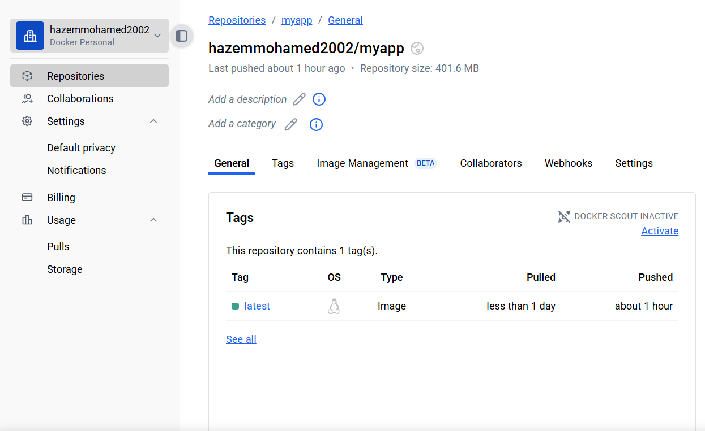
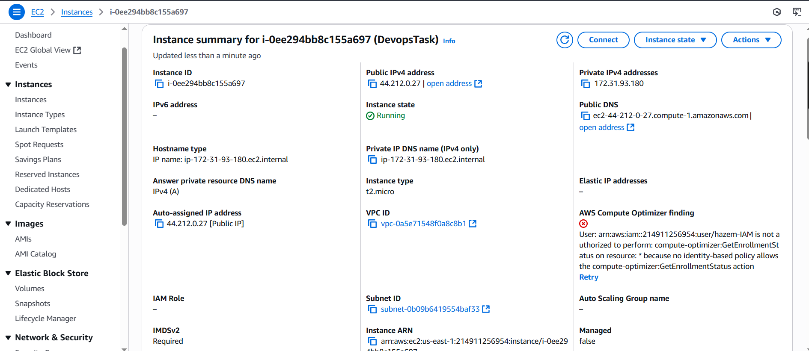
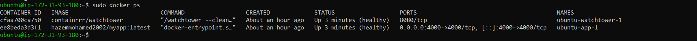
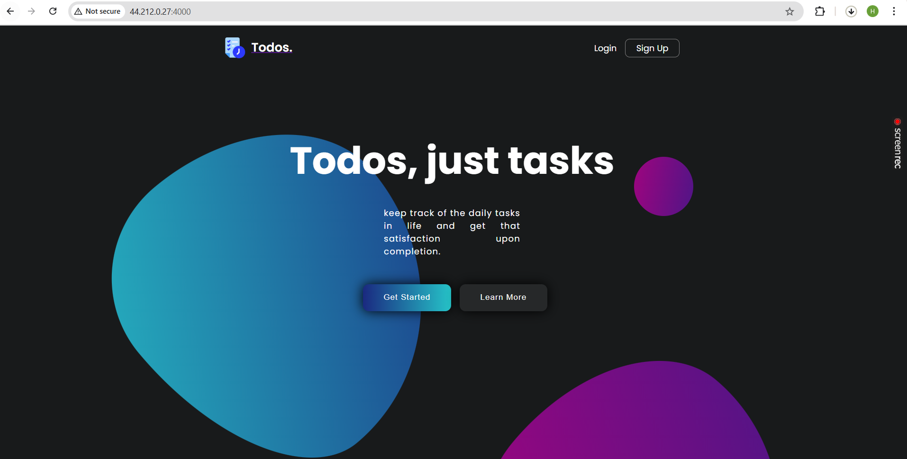

## 📝 Summary

It was a pleasure to work on this DevOps task. I successfully completed the first three parts and made significant progress on the final part related to Kubernetes. Although I researched Kubernetes thoroughly and prepared the deployment script, I was unable to get it fully working due to time constraints.

## ✅ Part 1: Dockerization & CI
I containerized the application by writing a Dockerfile and implemented a CI pipeline using GitHub Actions to automate the continuous integration of the Docker image..


```bash
from node:18 

workdir /app

copy package*.json ./
run npm install 

copy . . 

expose 4000 

# Start the app
CMD ["npm", "start"]


```


```bash
name: CI - Build and Push Docker Image

on:
  push:
    branches:
      - master

jobs:
  build-and-push:
    runs-on: ubuntu-latest

    steps:
      - name: Checkout code
        uses: actions/checkout@v3

      - name: Set up Docker Buildx
        uses: docker/setup-buildx-action@v3

      - name: Log in to Docker Hub
        uses: docker/login-action@v3
        with:
          username: ${{ secrets.REGISTRYUSERNAME }}
          password: ${{ secrets.REGISTRYPASSWORD }}

      - name: Build and Push Docker Image
        uses: docker/build-push-action@v5
        with:
          context: .
          push: true
          tags: hazemmohamed2002/myapp:latest
```


## Repo in Docker Registry




## ✅ Part 2: Ec2 and Ansible PlayBooks


```bash
[aws_vm]
44.212.0.27 ansible_user=ubuntu ansible_ssh_private_key_file=devops90.pem
```

```bash
- name: Install Docker on AWS EC2 instance
  hosts: aws_vm
  become: true

  tasks:
    - name: Update apt cache
      apt:
        update_cache: yes

    - name: Install required packages
      apt:
        name:
          - apt-transport-https
          - ca-certificates
          - curl
          - software-properties-common
        state: present

    - name: Download Docker GPG key locally
      delegate_to: localhost
      ansible.builtin.get_url:
        url: https://download.docker.com/linux/ubuntu/gpg
        dest: /tmp/docker_gpg

    - name: Copy Docker GPG key to remote
      ansible.builtin.copy:
        src: /tmp/docker_gpg
        dest: /tmp/docker_gpg
        mode: '0644'

    - name: Add Docker GPG key manually
      ansible.builtin.command:
        cmd: apt-key add /tmp/docker_gpg
      args:
        warn: false

    - name: Add Docker repository
      apt_repository:
        repo: deb [arch=amd64] https://download.docker.com/linux/ubuntu focal stable
        state: present

    - name: Install Docker
      apt:
        name: docker-ce
        state: latest
        update_cache: yes

    - name: Ensure Docker is started and enabled
      service:
        name: docker
        state: started
        enabled: yes
```
# run ansible playbook to install docker remotely on Ec2
```bash
ansible-playbook -i inventory.ini docker-setup.yml
```

## ✅ Part 3: Deploy the app using docker compose and watchtower for monitor running containers
```bash
version: '3.8'

services:
  app:
    image: hazemmohamed2002/myapp:latest
    ports:
      - "4000:4000"
    healthcheck:
      test: ["CMD", "curl", "-f", "http://localhost:4000/health"]
      interval: 30s
      timeout: 10s
      retries: 3
      start_period: 10s
    restart: always

  watchtower:
    image: containrrr/watchtower
    volumes:
      - /var/run/docker.sock:/var/run/docker.sock
    command: --cleanup --interval 60
    restart: always
```



